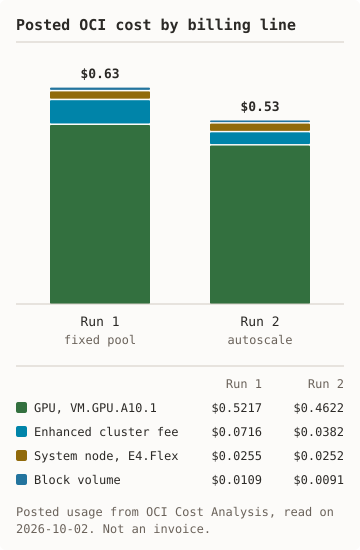

# Nimble OKE — NVIDIA NIM on Oracle Kubernetes Engine

Shell scripts and a Helm chart that take an NVIDIA NIM LLM microservice from
nothing to a served request on Oracle Kubernetes Engine (OKE), then tear
everything down. The project is a smoke-test harness, not a production
platform. Its focus is the part that costs money when it goes wrong:
provisioning a GPU node pool and proving it was deleted.

Both modes have been measured end to end, once each. See the
[run 1 receipt](docs/runs/2026-10-01-run-1-fixed.md) (fixed GPU pool) and the
[run 2 receipt](docs/runs/2026-10-01-run-2-autoscale.md) (GPU node autoscaling
0→1→0 on one A10) for every measured number in this file.

**Based on:** [NVIDIA nim-deploy, Oracle OKE reference](https://github.com/NVIDIA/nim-deploy/tree/main/cloud-service-providers/oracle/oke)

## Status

- **First deployment:** October 2025, on a cluster built with the Console's Quick Create plus `oci` CLI steps for what the Console could not do. NIM served inference. No run receipt was kept.
- **Measured run, fixed GPU pool:** 2026-10-01: PASS. Provision in 15 min 53 s, deploy in 6 min 56 s, 5 of 5 benchmark requests, teardown confirmed clean. [Receipt](docs/runs/2026-10-01-run-1-fixed.md). It is the first proof of the scripted provisioning path.
- **Measured run, autoscaling 0 to 1 to 0:** 2026-10-01: PASS, once, on one A10. Pod Pending to GPU node Ready in 385 s; zero replicas to no GPU node in 312 s; teardown clean on the first attempt. [Receipt](docs/runs/2026-10-01-run-2-autoscale.md).
- **Review pass:** October 2026. Teardown, provisioning, and secret handling were reworked. See [What changed in October 2026](docs/review-2026-10.md).
- **CI:** Shellcheck, stubbed tests of the runner and of the provision and teardown scripts, Helm lint and render, secret scan.

Timing and cost figures elsewhere in this repository that come from the
simulation scripts are estimates from static assumptions. They are labelled
as estimates. Only a file in `docs/runs/` is a measurement.

## Measured results

One run of each mode on 2026-10-01, `us-phoenix-1`, one `VM.GPU.A10.1`.

<picture><source media="(prefers-color-scheme: dark)" srcset="docs/diagrams/measured-dark.svg"/></picture> <picture><source media="(prefers-color-scheme: dark)" srcset="docs/diagrams/attempts-dark.svg"/></picture>

<details><summary>Text version of the charts</summary>

Scale-up 385 s on OKE and 77 s on GKE. Scale-down 312 s on OKE with timers set to 3 minutes and 752 s on GKE with the default delay. Script start to NIM Ready with autoscale 23 min 04 s on OKE and 16 min 07 s on GKE. Posted list cost for every start $1.17 on OKE and $1.19 on GKE.

Six starts on 2026-10-01. 18:46 fixed pool failed at node pool create, $0.0017. 19:00 fixed pool passed, $0.63. About 20:00 IAM apply failed with 403. About 20:05 IAM check gave a false fail. 20:07 autoscale failed in preflight. 20:12 autoscale passed, $0.53.

</details>

Costs are posted usage from OCI Cost Analysis, read on 2026-10-02, not an
invoice. Each receipt shows the lines. Five requests on one
stream is a smoke test, not a performance result. Run 1's slow teardown was
the default node drain; the kit now skips it, and run 2 shows the effect.
Four other starts failed that day, for $0.0017 in total. The
[attempt log](docs/runs/README.md#every-attempt-including-the-failures) lists
each one with its cause and fix.
The per-run figures are in [docs/runs/](docs/runs/README.md); the rates
and shapes in the [reference](docs/reference.md).

## What it deploys

<picture><source media="(prefers-color-scheme: dark)" srcset="docs/diagrams/deploys-dark.svg"/></picture> <picture><source media="(prefers-color-scheme: dark)" srcset="docs/diagrams/cost-dark.svg"/></picture>

<details><summary>Text version of the charts, components, and two limits</summary>

A client (curl or an OpenAI SDK) calls the NIM pod over the OpenAI-compatible API on port 8000. The NIM pod runs `llama3-8b-instruct` 1.0.3. It pulls its image from the NGC registry and keeps model files on a 100 Gi block volume. It is scheduled on one GPU node, `VM.GPU.A10.1`. With `--autoscale`, the Cluster Autoscaler on the E4.Flex system node adds and removes that node. The pod, volume, GPU node, and autoscaler sit inside the OKE enhanced cluster, Kubernetes v1.34.1.

Run 1 posted $0.63: GPU $0.5217, enhanced cluster $0.0716, system node $0.0255, block volume $0.0109. Run 2 posted $0.53: GPU $0.4622, enhanced cluster $0.0382, system node $0.0252, block volume $0.0091.

| Component | Value |
|-----------|-------|
| Cluster | OKE enhanced cluster, Kubernetes v1.34.1 |
| GPU node pool | `VM.GPU.A10.1` by default: one NVIDIA A10 (24 GB), 15 OCPU, 240 GB RAM |
| System node pool | One `VM.Standard.E4.Flex` node, 2 OCPU and 16 GB. It runs cluster DNS and the autoscaler. |
| Model | `nvcr.io/nim/meta/llama3-8b-instruct:1.0.3` (Llama 3 8B Instruct) |
| Storage | 100 Gi block volume for the model cache |
| Endpoint | OpenAI-compatible API on port 8000 |

Two limits you should know before you rely on this stack:

- **The image is past NVIDIA's end of support.** The NGC catalog marks
  `llama3-8b-instruct` 1.x as no longer supported. The current NIM LLM line
  is 2.x (`llama-3.1-8b-instruct`). This repository keeps the image that was
  deployed here. An upgrade is a separate, unmeasured change.
- **The A10 is not on NVIDIA's optimized list for this model.** NVIDIA's
  support matrix lists the A10G. OCI's A10 runs under the generic
  configuration, which NVIDIA describes as not guaranteed.

</details>

## Quick start

- An OCI paid account and a compartment. The default GPU limit is 0. Request
  an increase for `gpu-a10-count` in the Console under Limits, Quotas and Usage.
- An NGC API key with access to `nvcr.io`.
- `oci`, `kubectl`, `helm`, `jq`, `python3`, `curl`, and `bc` on the path.

Details: [docs/setup-prerequisites.md](docs/setup-prerequisites.md).

```bash
export OCI_COMPARTMENT_ID=\
ocid1.compartment.oc1..your-compartment
export OCI_REGION=us-phoenix-1
```

Keep the NGC key in a file that only you can read, and export it from there.
Typing the key on a command line puts it in shell history.

```bash
chmod 600 ~/.ngc-key
export NGC_API_KEY="$(cat ~/.ngc-key)"
```

1. Check access, quota, and configuration. Bills: No.

   ```bash
   scripts/run_measured.sh \
     --preflight-only /tmp/preflight
   ```

2. Create the cluster and GPU node pool. Bills: Yes, from here.

   ```bash
   make provision CONFIRM_COST=yes
   ```

3. Check the cluster, the GPU, and registry access. Bills: Yes.

   ```bash
   make prereqs
   ```

4. Deploy NIM. Bills: Yes.

   ```bash
   make install CONFIRM_COST=yes
   ```

5. Check health and send one inference request. Bills: Yes.

   ```bash
   make verify
   ```

6. Remove NIM, keep the cluster. Bills: Yes.

   ```bash
   make cleanup
   ```

7. Delete the node pool and cluster. Bills: Stops here.

   ```bash
   make teardown
   ```

The NGC key is passed to Helm on standard input at install time. It is not
written to disk. The chart has no default key and refuses to render without one.

## Measured run

`scripts/run_measured.sh` runs the whole path once and records it:
preflight, provision, deploy, wait for ready, benchmark, teardown, and a
check that nothing is left.

<picture><source media="(prefers-color-scheme: dark)" srcset="docs/diagrams/autoscale-dark.svg"/></picture> <picture><source media="(prefers-color-scheme: dark)" srcset="docs/diagrams/runner-ends-dark.svg"/></picture>

<details><summary>Text version of the charts</summary>

The GPU node pool starts at 0 nodes. The NIM pod goes Pending and asks for one GPU. The GPU node is Ready 385 s later. NIM serves 5 of 5 requests, then replicas are set to 0. The pool is back at 0 nodes 312 s after that.

Preflight checks that the step timeouts fit the watchdog limit. The watchdog is armed in its own session before anything billable exists. The steps run, each with a hard timeout. Teardown runs from a trap on every exit and is retried until the deletes are confirmed; the runner then exits 0 with the cluster deleted. If the runner dies or the time limit passes, the watchdog runs teardown. If teardown cannot be confirmed, the runner exits non-zero, prints the `oci` delete commands, and leaves the watchdog armed.

</details>

Fixed pool, with `OCI_COMPARTMENT_ID` exported as in the quick start:

```bash
scripts/run_measured.sh \
  --key-file ~/.ngc-key \
  docs/runs/2026-10-01-fixed
```

Autoscale, after the one-time IAM setup in
[autoscaling and the runner](docs/autoscaling-and-runner.md):

```bash
scripts/run_measured.sh --autoscale \
  --key-file ~/.ngc-key \
  docs/runs/2026-10-01-autoscale
```

The key file must have mode 600 or 400. The output directory must be new or
empty.

The runner ends with the cluster deleted, or exits non-zero with the
watchdog still armed; the receipt records every phase. Details, scope, and
the IAM setup: [docs/autoscaling-and-runner.md](docs/autoscaling-and-runner.md).

## Known gaps

- Two measured runs are committed, one per mode. One run of each does not show repeatability.
- The Kubernetes API endpoint is public and open on 6443 by default. Set `API_ALLOWED_CIDR` to narrow it.
- The node image OCID is pinned to Phoenix. Other regions need a different image.
- The pod runs as uid 1000 with no further hardening. The chart says so.
- The NVIDIA device plugin is pinned at v0.14.0 and has not been re-tested against newer releases.
- The scripts are tested on bash 3.2. Bash 5 is exercised only in CI.
- Autoscaling is limited to one GPU node and has been measured once.
- The watchdog runs on the machine that starts the run. If that machine loses power or sleeps with the lid closed, nothing tears the cluster down until it wakes.

## More

- [OKE compared with GKE](docs/compared-with-gke.md), with the measured runs side by side.
- [What changed in October 2026](docs/review-2026-10.md): the review's defects and fixes.
- [Reference](docs/reference.md): repository layout, Makefile targets, variables, references.
- [Quick start](docs/QUICKSTART.md), [runbook](docs/RUNBOOK.md), [API examples](docs/api-examples.md), [prerequisites](docs/setup-prerequisites.md).
- [Receipts and every attempt](docs/runs/README.md).

## License

MIT. See [LICENSE](LICENSE). NVIDIA NIM and Oracle Cloud services are subject
to their own terms.

---

**Last measured**: 2026-10-01. See the
[run 1 receipt](docs/runs/2026-10-01-run-1-fixed.md) and the
[run 2 receipt](docs/runs/2026-10-01-run-2-autoscale.md).
