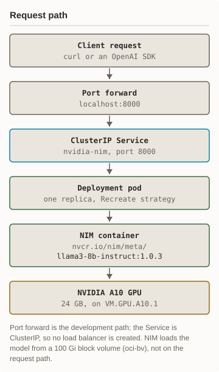
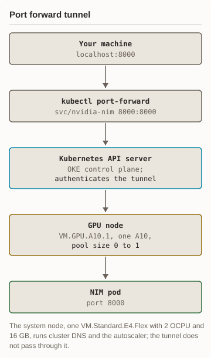

# Architecture

How a request reaches the model, and the tunnel it travels through. The
README's [what it deploys](../README.md#what-it-deploys) picture shows the same
parts as a map; these two follow one request.

<picture><source media="(prefers-color-scheme: dark)" srcset="diagrams/architecture-request-dark.svg"/></picture> <picture><source media="(prefers-color-scheme: dark)" srcset="diagrams/architecture-network-dark.svg"/></picture>

Text version of the diagrams

Request path: a client request (curl or an OpenAI SDK) goes to the port
forward on `localhost:8000`, then the ClusterIP Service `nvidia-nim` on port
8000, the Deployment's one pod (Recreate strategy), and the NIM container
`nvcr.io/nim/meta/llama3-8b-instruct:1.0.3`, which runs the model on one
NVIDIA A10 with 24 GB on `VM.GPU.A10.1`. The Service is ClusterIP, so no load
balancer is created. NIM loads the model from a 100 Gi block volume (storage
class `oci-bv`), not on the request path.

Port forward tunnel: `kubectl port-forward svc/nvidia-nim 8000:8000` carries
`localhost:8000` through the Kubernetes API server on the OKE control plane,
which authenticates the tunnel, to the GPU node (`VM.GPU.A10.1`, one A10,
pool size 0 to 1) and port 8000 on the NIM pod. The system node, one
`VM.Standard.E4.Flex` with 2 OCPU and 16 GB, runs cluster DNS and the
autoscaler; the tunnel does not pass through it.

Every name in both pictures comes from [helm/values.yaml](../helm/values.yaml),
[API examples](api-examples.md), the README, or the
[run 2 receipt](runs/2026-10-01-run-2-autoscale.md); `charts.py` checks each
one is still there. The same pair for GKE is in nim-gke's
[ARCHITECTURE.md](https://github.com/frankbesch/nim-gke/blob/main/docs/ARCHITECTURE.md).
