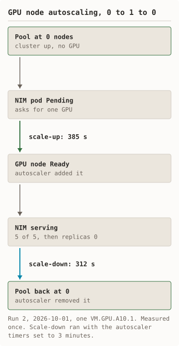

# GPU node autoscaling and how the runner ends

<picture><source media="(prefers-color-scheme: dark)" srcset="diagrams/autoscale-dark.svg"/></picture> <picture><source media="(prefers-color-scheme: dark)" srcset="diagrams/runner-ends-dark.svg"/></picture>

<details><summary>Text version of the diagrams</summary>

The GPU node pool starts at 0 nodes. The NIM pod goes Pending and asks for one GPU. The GPU node is Ready 385 s later. NIM serves 5 of 5 requests, then replicas are set to 0. The pool is back at 0 nodes 312 s after that.

Preflight checks that the step timeouts fit the watchdog limit. The watchdog is armed in its own session before anything billable exists. The steps run, each with a hard timeout. Teardown runs from a trap on every exit and is retried until the deletes are confirmed; the runner then exits 0 with the cluster deleted. If the runner dies or the time limit passes, the watchdog runs teardown. If teardown cannot be confirmed, the runner exits non-zero, prints the `oci` delete commands, and leaves the watchdog armed.

</details>

`--autoscale` creates the GPU node pool with no nodes and installs Oracle's
Cluster Autoscaler add-on on the system node. The pending NIM pod triggers
one GPU node. After the benchmark, the runner scales NIM to zero replicas and
waits for the autoscaler to remove the node.

The autoscaler needs a dynamic group and a policy in your tenancy. Oracle
documents the six statements. The setup script prints them, checks for them,
or creates them after a typed confirmation.

Print the statements:

```bash
scripts/setup-autoscaler-iam.sh --print
```

Check for them:

```bash
scripts/setup-autoscaler-iam.sh --check
```

Create them:

```bash
scripts/setup-autoscaler-iam.sh --apply
```

Run the free preflight for the autoscale mode:

```bash
scripts/run_measured.sh --autoscale --preflight-only /tmp/preflight
```

Start the autoscale run:

```bash
scripts/run_measured.sh --autoscale --key-file ~/.ngc-key docs/runs/2026-10-01-autoscale
```

The receipt records the seconds from pod Pending to GPU node Ready, the
seconds from zero replicas to no GPU node, the autoscaler timers, GPU-node
minutes, and a line `autoscale result: 0→1→0 PASS` or `FAIL` with the reason.

Scope: one GPU node, measured once. `MAX_GPU_NODES` above 1 is refused.
Oracle's documentation does not state that a node pool can scale up from zero
nodes. [Run 2](runs/2026-10-01-run-2-autoscale.md) shows that it does,
with add-on 1.34.3.

## How the runner ends

The runner is built to end with the cluster deleted:

- A trap runs teardown on success, failure, Ctrl-C, `TERM`, and `HUP`, and retries it until the deletes are confirmed.
- Each step has a hard timeout. Preflight refuses to start if the watchdog limit is shorter than the step timeouts combined.
- A watchdog runs in its own session, outside the terminal's process tree.
  It starts before anything billable exists. It takes over teardown if the
  runner dies, and at a time limit.
- If teardown cannot be confirmed, the runner exits non-zero, leaves the
  watchdog armed, and prints the `oci` commands to delete by hand.
- The NGC key never appears in the logs or in process arguments.

The runner's behaviour is tested with stubs in [tests/](../tests/). Those tests
make no cloud call.
