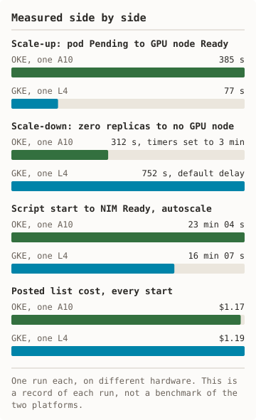
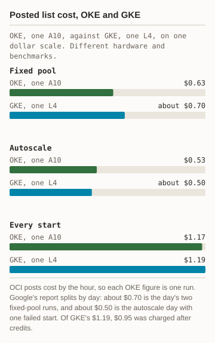

# OKE compared with GKE

This kit has a companion, [nim-gke](https://github.com/frankbesch/nim-gke),
that does the same job on Google Kubernetes Engine: deploy NIM with Helm,
track cost, clean up, and measure GPU node autoscaling. The two platforms
reach the same result. OKE needs more explicit setup. The list shows what
each kit has to do itself.

- **Hardware and image**
  - **OKE:** `VM.GPU.A10.1`, one NVIDIA A10 (24 GB). Own Helm chart. `llama3-8b-instruct:1.0.3`.
  - **GKE:** `g2-standard-4`, one NVIDIA L4 (24 GB). NVIDIA's `nim-llm` chart 1.3.0. `llama3-8b-instruct:1.0.0`.
- **Network rules for node registration**
  - **OKE:** The kit creates two security lists: workers to the API endpoint on 6443 and 12250, the control plane to workers, and node to node.
  - **GKE:** GKE creates the ingress firewall rules when it creates the cluster. The kit sets none.
- **Subnets**
  - **OKE:** The kit creates an API endpoint subnet and a worker subnet. A node pool cannot use the cluster's service load-balancer subnet.
  - **GKE:** The kit passes no network flags and uses the project's default network.
- **Root filesystem**
  - **OKE:** The GPU node pool runs `oci-growfs` in cloud-init. Without it the root filesystem stays near 35 GB whatever the boot volume size.
  - **GKE:** The kit uses the default boot disk and has no resize step.
- **GPU drivers and device plugin**
  - **OKE:** The GPU node image carries the drivers. The kit checks for an allocatable GPU and applies the NVIDIA device plugin if none is reported.
  - **GKE:** The node pool sets `gpu-driver-version`, and GKE installs the drivers. The kit applies no device plugin.
- **GPU taint and toleration**
  - **OKE:** The autoscaler treats GPU nodes as tainted `nvidia.com/gpu:NoSchedule`. The chart carries the toleration.
  - **GKE:** GKE adds the taint `nvidia.com/gpu=present:NoSchedule` and adds the toleration to pods that request a GPU.
- **System node**
  - **OKE:** One CPU node pool that the autoscaler does not manage. Oracle requires it to run the autoscaler and cluster add-ons.
  - **GKE:** The default CPU node pool runs system pods. Google states that a Standard cluster keeps at least one node for them.
- **Cluster autoscaler**
  - **OKE:** The kit installs the Cluster Autoscaler add-on with `min:max:pool` and its scale-down timers.
  - **GKE:** Three flags on the node pool: `--enable-autoscaling`, `--min-nodes`, `--max-nodes`. The kit deploys no autoscaler.
- **Autoscaler permissions**
  - **OKE:** A dynamic group and a six-statement policy, created once by the account owner. IAM writes go to the tenancy's home region.
  - **GKE:** The kit creates none.
- **GPU pool from zero nodes**
  - **OKE:** Measured once: 0 to 1 to 0 on one A10, in nimble-oke run 2. Oracle's documentation does not state it. The pool carries a tag that tells the autoscaler the node's storage.
  - **GKE:** Measured once: 0 to 1 to 0 on one L4, in nim-gke run 3.
- **GPU quota**
  - **OKE:** A service limit per availability domain, `gpu-a10-count`. The default is 0.
  - **GKE:** A project quota, `GPUS_ALL_REGIONS`, plus the regional GPU quota.
- **Confirming a delete**
  - **OKE:** A delete returns a work request. The kit waits for it, then polls the resource state. A node pool delete drains nodes for up to 60 minutes by default; the kit passes a zero grace period at teardown.
  - **GKE:** `gcloud` waits for the delete. The kit then checks for a leftover model-store disk.
- **Cluster fee**
  - **OKE:** $0.10 per hour for an enhanced cluster. Basic clusters are free and cannot run the add-on.
  - **GKE:** The zonal cluster fee applies on both paths.

None of these is a defect in either platform. They are the steps a script
must own on OKE and can leave to the platform on GKE. The same list appears
in both repositories.

Sources: each kit's own scripts for what the kit does. For platform
behaviour, Google's GKE documentation on GPUs, firewall rules, and the
cluster autoscaler, and Oracle's OKE documentation on the Cluster Autoscaler
add-on, custom cloud-init, and GPU workloads, read on 2026-10-01. The measured
runs in each repository's `docs/runs/` show which rows are proven against the
real API.

## Measured side by side

<picture><source media="(prefers-color-scheme: dark)" srcset="diagrams/compare-measured-dark.svg"/></picture> <picture><source media="(prefers-color-scheme: dark)" srcset="diagrams/compare-cost-dark.svg"/></picture>

Text version of the diagrams

Scale-up 385 s on OKE and 77 s on GKE. Scale-down 312 s on OKE with timers set to 3 minutes and 752 s on GKE with the default delay. Script start to NIM Ready with autoscale 23 min 04 s on OKE and 16 min 07 s on GKE. Posted list cost for every start $1.17 on OKE and $1.19 on GKE.

Posted list cost on one dollar scale. Fixed pool: $0.63 on OKE; about $0.70 on GKE for the day's two runs. Autoscale: $0.53 on OKE; about $0.50 on GKE for the day, with one failed start. Every start: $1.17 on OKE; $1.19 on GKE, of which $0.95 was charged after credits.

The two kits were measured on different hardware, so this list is a record
of what each run did. It is not a benchmark of the two platforms.

- **Measured runs**
  - OKE, one A10: 2, on 2026-10-01
  - GKE, one L4: 3, on 2026-09-27 and 2026-09-28
- **Script start to NIM Ready, fixed pool**
  - OKE, one A10: 22 min 52 s
  - GKE, one L4: 20 min 19 s; 18 min 53 s
- **Script start to NIM Ready, autoscale**
  - OKE, one A10: 23 min 04 s
  - GKE, one L4: 16 min 07 s
- **Scale-up: pod Pending to GPU node Ready**
  - OKE, one A10: 385 s
  - GKE, one L4: 77 s
- **Scale-down: zero replicas to no GPU node**
  - OKE, one A10: 312 s, with the timers set to 3 minutes
  - GKE, one L4: 752 s, with GKE's default delay
- **Teardown**
  - OKE, one A10: 6 min 54 s after the drain fix; 30 min 55 s before it
  - GKE, one L4: 5 min 51 s to 6 min 39 s
- **GPU time metered, fixed pool**
  - OKE, one A10: 15 min 39 s
  - GKE, one L4: about 18 min per run
- **GPU time metered, autoscale**
  - OKE, one A10: 13 min 52 s
  - GKE, one L4: about 24 min
- **Posted list cost, fixed pool**
  - OKE, one A10: $0.63
  - GKE, one L4: about $0.70 for the day's two runs
- **Posted list cost, autoscale**
  - OKE, one A10: $0.53
  - GKE, one L4: about $0.50 for the day, with one failed start
- **Posted list cost, every start**
  - OKE, one A10: $1.17
  - GKE, one L4: $1.19, of which $0.95 was charged after credits
- **GPU list rate**
  - OKE, one A10: $2.00 per hour
  - GKE, one L4: about $0.56 per hour; $0.71 with its host VM
- **Output throughput, one stream**
  - OKE, one A10: 27.6 tokens/s
  - GKE, one L4: 15.9 tokens/s

How to read it:

- The scale-down times are not like for like. The OKE run shortened the
  autoscaler timers from 10 minutes to 3. The GKE run used the default.
- The benchmarks differ. The OKE runs sent 5 requests with 128 maximum
  tokens. The GKE runs sent 20 with 256. The images differ too: 1.0.3 on
  OKE, 1.0.0 on GKE.
- OCI reports cost by the hour, so each OKE run has its own posted cost.
  Google's report splits by day, so the GKE figures are per day.
- Each figure is one run, or two for the GKE fixed pool. None shows
  repeatability.

Sources: [nimble-oke receipts](https://github.com/frankbesch/nimble-oke/tree/main/docs/runs)
and [nim-gke receipts](https://github.com/frankbesch/nim-gke/tree/main/docs/runs).
The same list appears
in both repositories.
