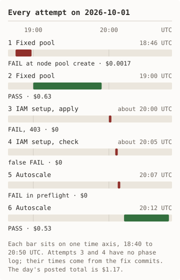

# Measured runs

Each Markdown file here is the receipt of one run of `scripts/run_measured.sh`
against a real OCI account. A receipt records the date, region, shape, image,
Kubernetes version, time per phase, OCI work-request times, benchmark
numbers, an itemised cost with its rate basis, and the teardown result. The
cost is an estimate until OCI posts the usage; both receipts below now carry
posted cost.

A receipt holds no OCIDs, no IP addresses, and no key. The runner writes its
raw output, including `receipt.md`, `summary.json`, and step logs, to the
directory you name. Those directories stay out of git.

| Run | Mode | Result |
|---|---|---|
| [2026-10-01, run 1](2026-10-01-run-1-fixed.md) | Fixed, one `VM.GPU.A10.1` | PASS: NIM served 5 of 5 requests; teardown clean |
| [2026-10-01, run 2](2026-10-01-run-2-autoscale.md) | Autoscale, GPU pool 0 to 1 to 0 | PASS: scale-up 385 s, scale-down 312 s; teardown clean on the first attempt |

## Every attempt, including the failures

<picture><source media="(prefers-color-scheme: dark)" srcset="../diagrams/attempts-dark.svg"/></picture>

Text version of this diagram

Six starts on 2026-10-01. 18:46 fixed pool failed at node pool create, $0.0017. 19:00 fixed pool passed, $0.63. About 20:00 IAM apply failed with 403. About 20:05 IAM check gave a false fail. 20:07 autoscale failed in preflight. 20:12 autoscale passed, $0.53.

Six starts on 2026-10-01 produced the two receipts above. Times are UTC, from
each run's phase log. Posted cost is from OCI Cost Analysis, read on
2026-10-02. The day's posted total is $1.17.

| # | Start | Duration | Attempt | Outcome | Cause | Fix | Posted cost |
|---|---|---|---|---|---|---|---|
| 1 | 18:46 | 12 min 40 s | Fixed pool | FAIL at node pool create; trap and teardown left the account clean | The cluster's service load-balancer subnet was the worker subnet. OKE refuses a node pool on that subnet. | `b49ca6d`: assign no service load-balancer subnet | $0.0017 |
| 2 | 19:00 | 54 min 12 s | Fixed pool | PASS; teardown clean on the third attempt | Teardown read the pool state once, treated 409 as a failure, and used the default 60-minute drain | `48d766c`: poll state, wait on 409, zero eviction grace | $0.63 |
| 3 | about 20:00 | seconds | IAM setup, apply | FAIL, 403 | The script sent an IAM write to Phoenix. IAM writes go to the home region. | `9eaab59`: resolve the home region | $0 |
| 4 | about 20:05 | seconds | IAM setup, check | False FAIL on a correct rule | The list call returns the dynamic-group rule empty | `ee07cd7`: read the rule with a get call | $0 |
| 5 | 20:07 | 2 s | Autoscale | FAIL in preflight; nothing created | The shell had a placeholder compartment ID from a profile file | `3ccc682`: preflight names that cause | $0 |
| 6 | 20:12 | 35 min 34 s | Autoscale | PASS; teardown clean on the first attempt | none | none | $0.53 |

Attempts 3 and 4 have no phase log. Their times come from the fix commits.

What the failures changed in the kit:

- Three of them were rules the OCI service enforces and the offline CLI help
  does not show: the subnet rule, the home-region rule, and the default drain.
  Only a live run finds these.
- No failure left a billable resource behind. The failed provision cost one
  minute of cluster fee.
- `tests/live_path_test.sh` now covers the subnet fix, the home-region fix,
  and the zero eviction grace. The 409 wait, the rule read, and the
  placeholder check have no stub test yet.
